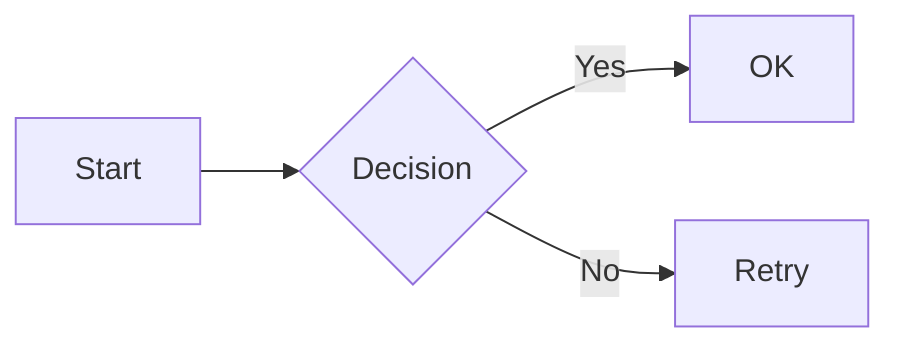

# Sample Markdown

## With Mermaid


```mermaid
flowchart LR
    A[Start] --> B{Decision}
    B -->|Yes| C[OK]
    B -->|No| D[Retry]
```

## Code block

```javascript
function hello() {
  console.log('Hello MD Viewer');
}
```
